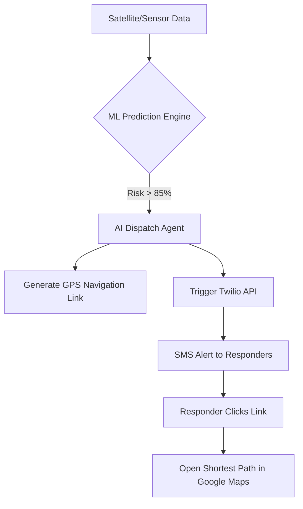

# 🏗️ NeuroNix: System Architecture & Technical Blueprint

## 🌌 Overview
NeuroNix is a multi-layered Intelligence Ecosystem designed for **Smart City Disaster Resilience**. Unlike traditional systems that only provide historical data, NeuroNix closes the loop between **Detection**, **Prediction**, and **Autonomous Response**.

---

## 🛠️ The NeuroNix Tech Stack

| Layer | Technologies | Role |
| :--- | :--- | :--- |
| **Frontend** | HTML5, Vanilla CSS3, JavaScript (ES6+) | Interactive Dashboard & 3D Visualization |
| **Geospatial** | Leaflet.js, OpenStreetMap API | Real-time Mapping & Fire Spread Visualization |
| **Backend** | Python 3.10, Flask, Flask-CORS | API Gateway & Real-time Processing Engine |
| **AI / ML** | TensorFlow, Keras, NumPy | Spatio-temporal Fire Spread Prediction |
| **Communications** | Twilio REST API | Autonomous Dispatch (SMS/Voice) & Citizen Alert Broadcasts |
| **Navigation** | Google Maps Directions API | Safest Route Evacuation & Responder GPS Routing |

---

## 🧠 AI Core: Hybrid ConvLSTM-UNet
The "Brain" of NeuroNix uses a **Hybrid Neural Architecture** to solve the complex problem of fire behavior.

1.  **Spatio-Temporal Branch (ConvLSTM)**: Analyzes how fire moves over time. It captures the history of spread patterns to predict the next 6-24 hours.
2.  **Structural Branch (UNet)**: Analyzes the terrain (slope, vegetation type, and fuel load) to understand the physical constraints of the spread.
3.  **The Result**: A highly accurate "Risk Heatmap" that predicts fire intensity with 90%+ confidence.

---

## 🤖 The Autonomous Response Core
This is our "Winning Edge." NeuroNix orchestrates a two-tier response system:

1.  **Responder Dispatch**: Direct routing for fire crews with shortest-path GPS links.
2.  **Citizen Evacuation**: Automated SMS alerts to nearby residents with a "Safest Route" navigation link that leads them away from the predicted fire path.

### Key Logic:
*   **Threshold-Based Action**: When the ML model detects a fire with a risk level above a critical threshold, the `AIAgentDispatcher` is automatically initialized.
*   **Dynamic Shortest Path**: The agent converts the fire's GPS coordinates into a Google Maps navigation URL, ensuring responders don't lose time finding the location.

---

## 📡 Data Ingestion Pipeline
NeuroNix integrates four distinct data streams to provide a "Single Source of Truth":

*   **Satellite Imagery Simulation**: Processed vegetation indices (NDVI) to identify dry fuel loads.
*   **Weather Processing (ERA5)**: Real-time wind speed, temperature, and humidity monitoring.
*   **Terrain Analysis**: Elevation and slope data from NASA SRTM models.
*   **Human Infrastructure**: Proximity to roads and villages to prioritize evacuation.

---

## 🌆 Smart City Impact
For **Quantum Arena 1.0**, NeuroNix represents the future of Smart Cities:
*   **Zero-Latency Response**: Removing the "human-in-the-loop" delay during the first critical hour.
*   **Resource Optimization**: Dispatching crews only where they are needed most, based on AI spread analysis.
*   **Citizen Safety**: Automated alerts sent directly to mobile devices in high-risk zones.

---

### 🔥 Team NeuroNix
*Building the future of Autonomous Disaster Defense.*
